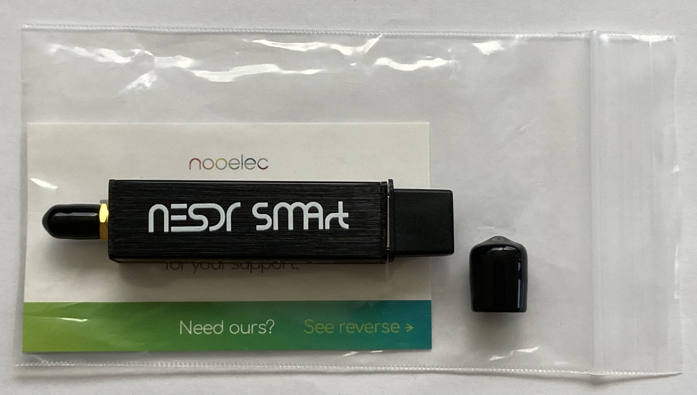
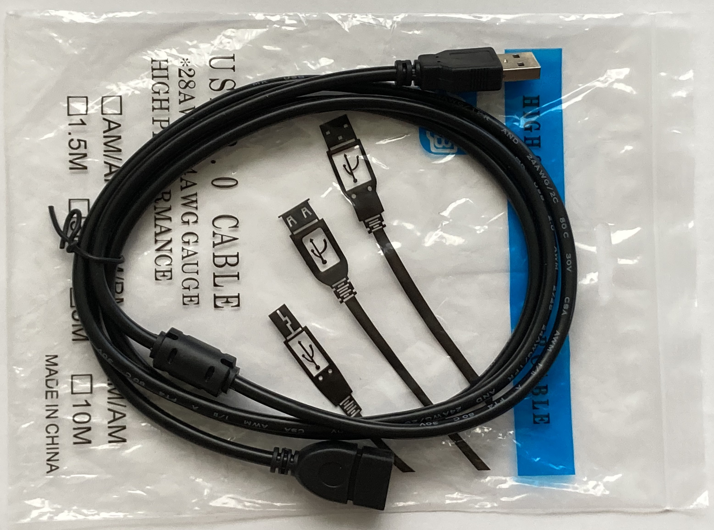
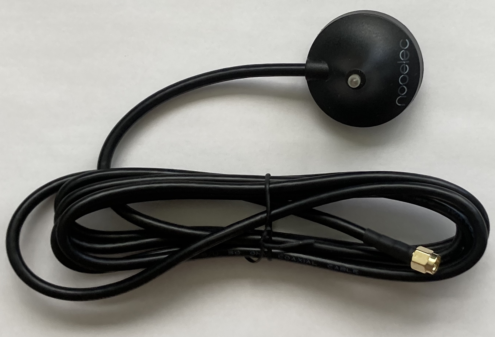
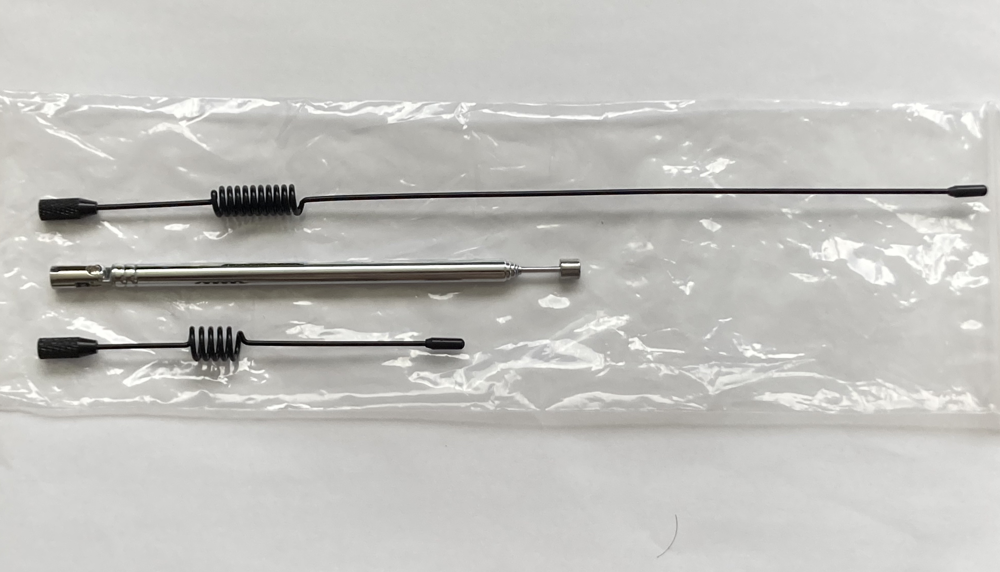

# Avionics Lab Guide

## Introduction

In this Laboratory we will be working with `Software Defined Radio` (SDR). You have been assigned a work station in the room and a SDR kit with everything you need. Before proceeding please verify the package is complete:

|     |     |     |     |
| --- | --- | --- | --- |
| NESDR SMArt Series |   | USB Extension | |
| Antena's Base |   | Antena Kit | |

It the coming sessions we will be working with this kit, alongside `SDRAngel` software and `MatLab` to capture and interpert radio comunications emited by Lisbon's Humberto Delgado Airport.
Once you have verified that no items are missing from your kit, head over to your work station so we can set it up with the required software.

### SDRAngel Setup
To get the software, just head over to the [download page](https://github.com/f4exb/sdrangel/releases). You'll find several downloadable assets of which you should choose the one with the `.tar.gz` extension as you are working on an Ubunto Linux distribution. SDRAngel developers have provided detailed descritpion on how to install the software [here](https://github.com/f4exb/sdrangel/wiki/Compile-from-source-in-Linux)

Go to the terminal and type the command
```bash
$picha coco
```
> **Warning:** This is an important warning message. Pay attention to this!

### SDRAngel Innitialization


## Listening to the COM Channel

To begin getting acquainted with `SDRAngel` we will start by listening to the COM channel.


## Step 3: Title of Step 3

Explanation and instructions for completing Step 3.

- First, do this.
- Then, do that.
- Finally, complete the task.

## Conclusion

Summarize the guide and provide any final thoughts or additional resources.

For more information, refer to the [official documentation](https://example.com).
