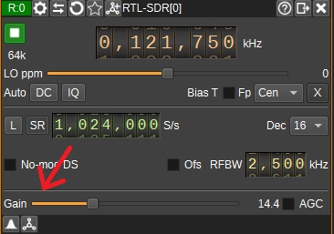

# Avionics Lab Guide

## Introduction

In this Laboratory we will be working with `Software Defined Radio` (SDR). You have been assigned a work station in the room and a SDR kit with everything you need. Before proceeding please verify the package is complete:

|     |     |     |     |
| --- | --- | --- | --- |
| NESDR SMArt Series |   | USB Extension | |
| Antena's Base |   | Antena Kit | |

It the coming sessions we will be working with this kit, alongside `SDRAngel` software and `MatLab` to capture and interpert radio comunications emited by Lisbon's Humberto Delgado Airport.
Once you have verified that no items are missing from your kit, head over to your work station so we can set it up with the required software.

### SDRAngel Setup
To get the software, just head over to the [download page](https://github.com/f4exb/sdrangel/releases). You'll find several downloadable assets of which you should choose the one with the `.tar.gz` extension as you are working on an Ubunto Linux distribution. SDRAngel developers have provided detailed descritpion on how to install the software [here](https://github.com/f4exb/sdrangel/wiki/Compile-from-source-in-Linux)

Go to the terminal and type the command
```bash
$picha coco
```
> **Warning:** This is an important warning message. Pay attention to this!

### NESDR SMART driver 
Before we can open SDRAngel, we have to download the driver for the NESDR in [download page](https://www.nooelec.com/store/qs). There you can find instructions on how to install.

### SDRAngel Innitialization

After setting up both the software and the drivers, you can open the SDRAngel program.

At first, it will look like this:

 


 First, you need to create a workspace. Press the workspaces button on the top left and then new on the drop down window:


Then, you can press the receiver button to look for your device:


Here you will choose a receiving device. Choose the RTL-SDR device:


The window will look like this. You will have to add a channel to the receiver to process samples. Press the button to add channels.


This opens the dialog where you can select which channel(s) to add. You can add more than one channel from this dialog by clicking Apply after each (or same) selection. In this example we will select "AM Demodulator" from the drpop down list. After this, press the play button on the top left window:


You are now ready to start listening to signals. Note that your setup will be saved and restored across program stop/start cycles as the default configuration. If you want to restart from scratch you have to specify the --scratch option on the command line. You can also save different configurations by opening a dialog from the Preferences / Configuration menu.


### SDRAngel Channel Control

Gain - With this slider, you can adjust the gain to adapt to strong or weak signal. It is a measure of how much the amplitude of the signal will be increased or decreased.



Sample rate (SR) - This is the device sample rate divided by the decimation factor. The sample rate refers to the number of samples per second that the device can process or capture. The sample rate determines how finely the radio frequency (RF) spectrum is divided into discrete samples. A higher sample rate means more samples are taken per second, allowing for a more detailed representation of the RF signal. However, it also requires more computational resources and places higher demands on storage and data transfer.


Center Frequency - This term refers to the specific frequency around which the software tunes or operates the receiver or transmitter. You should change this value to the provided for each different signal you want to listen to.


Frequency offset - The center frequency has a precision of kHz. This means that if you want to change the frequency in the hundreds of Hz, you will need to add or subtract with the offset option. Note that this is limited to the range of the bandwidth.


Squelch - This option helps eliminate unwanted noise or weak signals when receiving radio communications. It is designed to silence the audio output when the received signal falls below a certain threshold.


## Listening to the COM Channel

To start becoming familiar with SDRAngel, we'll begin by tuning into the COM channel.

The COM channel serves as a communication link for relaying instructions, clearances, weather updates, and other essential information to pilots. Different frequencies or channels are allocated for various flight phases and operational types, allowing us to monitor multiple COM channels.

Lisboa TWR (Tower) 118.105 MHz:
At this frequency, 118.105 MHz, communication occurs between the control tower at Lisbon Airport and aircraft within close proximity to the airport. The tower manages takeoffs, landings, and aircraft movements on runways and taxiways.

Lisboa APP (Approach) 119.105 MHz:
The frequency 119.105 MHz is dedicated to communication between aircraft and the approach control facility at Lisbon Airport. Approach controllers guide incoming flights as they enter the airport's airspace. They navigate aircraft through the landing sequence and ensure safe separation from other planes.

Lisboa Ground 121.755 MHz:
Communication between aircraft and the ground control facility at Lisbon Airport takes place at the frequency of 121.755 MHz. Ground controllers oversee aircraft movements on the ground, including taxiing to and from runways, gates, and other airport facilities.

These channels utilize AM modulation. Consequently, you'll need to select the "AM Demodulator" to listen to this type of signal. After picking one of these frequencies, you'll need to adjust various parameters and await a communication signal on the chosen channel. Experiment with changing these parameters to gain an understanding of their impact on the received results.

## NDB

NDBs are "non-directional" because they do not provide directional information like VOR (VHF Omni-Directional Range) or GPS (Global Positioning System) systems. Instead, an NDB only provides a reference point and distance information.
Aircraft equipped with ADF (Automatic Direction Finder) receivers can tune in to the NDB's frequency and determine the direction of the NDB relative to the aircraft's nose. By comparing this directional information with the known direction of the NDB station, pilots can determine their bearing from or to the NDB. NDBs are used for various purposes in aviation, including en route navigation, instrument approaches to airports, and providing fixes along airways.

## VOR

VOR, which stands for VHF Omni-Directional Range, is a type of radio navigation system used primarily in aviation for aircraft navigation. It provides pilots with both direction and distance information, allowing them to determine their position and track along specific airways or routes. VOR signals are transmitted from ground-based radio beacons located at airports and other strategic locations.


1: Frequency shift from center frequency of reception value

2: Level meter in dB

3: Channel power

4: Audio mute and audio output select

5: Morse ident threshold

6: Squelch threshold

7: Volume

8: Radial direction
Demodulated radial direction in degrees (unadjusted for magnetic declination). If there is a low confidence the value is correct (due to a weak signal), it will be displayed in red.

9: Reference signal power in dB
Magnitude of the received 30Hz FM reference signal in dB.

10. Variable signal power in dB
Magnitude of the received 30Hz AM variable signal in dB.

11. VOR identifier code (decoded)
Demodulated identifier. If an identifier is received that is not 2 or 3 characters, it will be displayed in yellow else in white.

12. VOR identifier code (Morse)
Demodulated Morse code identifier. Colour coding is the same as for the decoded identifier.


## ILS

These are the signals used by aircraft to perform precision approaches and auto-lands.

## Step 3: Title of Step 3

Explanation and instructions for completing Step 3.

- First, do this.
- Then, do that.
- Finally, complete the task.

## Conclusion

Summarize the guide and provide any final thoughts or additional resources.

For more information, refer to the [official documentation](https://example.com).
